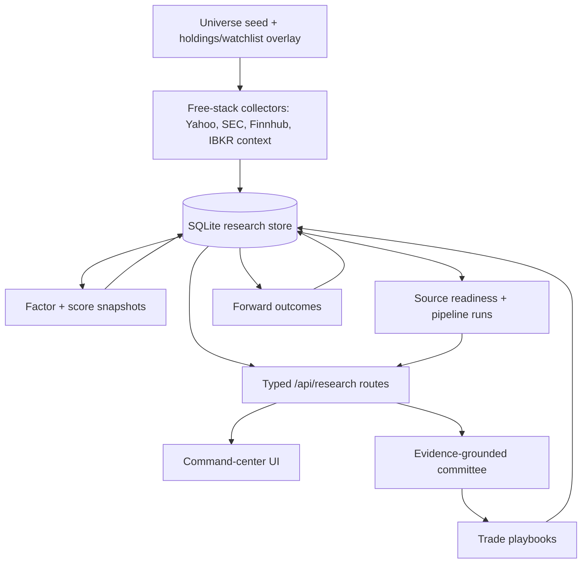
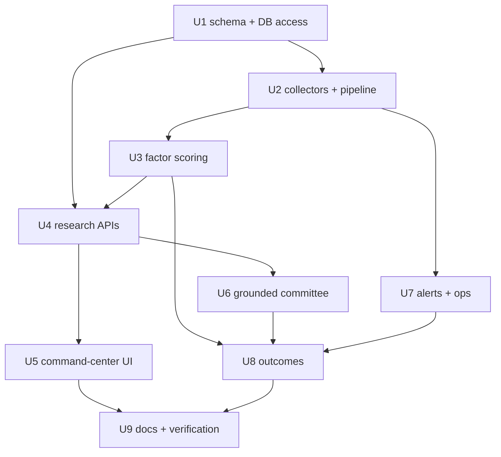
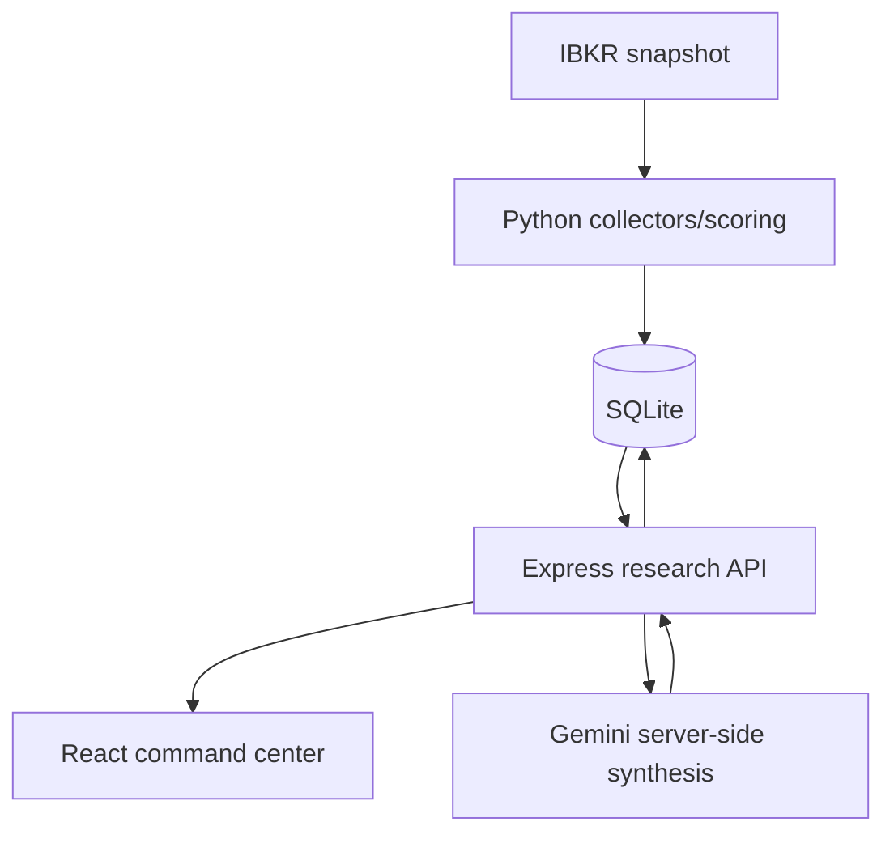

# feat: Build research command center foundation

## Summary

Build the Northstar 2.0 research-engine foundation: a normalized SQLite research store, disciplined Python collectors/scoring pipeline, typed TypeScript research APIs, command-center UI, grounded committee sessions, conservative alerts, and forward outcome tracking. This plan converts `STRATEGY.md` and `CONTEXT.md` from product direction into implementation-ready units without adding broker execution, paid data, cloud deployment, or SaaS scope.

---

## Problem Frame

Northstar currently has strong portfolio/IBKR context, partial evidence-packet work, and a thin SQLite proof-of-concept, but its scanner remains mock/hardcoded, watchlist/archive state is browser-local, readiness is one-row coarse status, and committee sessions can look authoritative without fully frozen, cited evidence. That conflicts with the new product center: deterministic scanner → curated watchlist → evidence-grounded committee → trade playbook → outcomes.

---

## Requirements

- R1. Establish SQLite as the canonical research store for securities, source runs, prices, fundamentals, events/news/chatter, factor snapshots, score snapshots, watchlist links, evidence packets, committee sessions, playbooks, alerts, and outcomes.
- R2. Preserve and migrate existing `runs` / `ticker_evidence` data without silently losing legacy evidence or creating blank databases from wrong paths.
- R3. Add a pre-open Python pipeline that starts with a small v1 universe (fixture seed + holdings/watchlist overlay), then can expand toward broader US liquid equities/ETFs after provider budgets are proven; it must collect free-stack data, compute factors/scores, and publish run/source readiness with degraded states.
- R4. Keep official/deterministic data as source of truth; mark yfinance/Finnhub/SEC/IBKR provenance, freshness, missing reasons, and confidence explicitly.
- R5. Serve typed `/api/research/*` contracts for readiness, briefing, scanner queues, security evidence, committee sessions, events, alerts, watchlist state, and outcomes.
- R6. Replace mock scanner claims with SQLite-backed compounder/tactical queues and visible source/freshness warnings.
- R7. Move durable watchlist, archive/playbook, thesis links, and decision state out of browser `localStorage` into SQLite while preserving existing user data where possible.
- R8. Require committee sessions to consume frozen evidence packets and produce trade playbooks only: entry, stop, target, deterministic risk-bounded size range, invalidation, review trigger, confidence, and citations.
- R9. Track 1w/1m/3m forward outcomes for scanner signals, committee playbooks, accepted/rejected decisions, and alerts versus SPY and available sector benchmark, with a lean v1 cutline that can ship schema + 1w job before full dashboards.
- R10. Preserve v1 boundaries: no broker execution, no options/crypto/global expansion, no paid data dependency, no public cloud hardening, no full SaaS auth/multi-tenancy.

---

## Scope Boundaries

- No broker order placement, execution routing, or automatic trade submission.
- No options, crypto, global multi-asset expansion, or derivatives-specific analytics.
- No paid market-data dependency for v1; design adapters so a paid provider can be added later.
- No public-cloud/security-hardening productization beyond keeping secrets server-side and avoiding credential exposure.
- No full SaaS auth, team workflow, or multi-tenant model.
- No treating rumors, Reddit, or chatter as primary score drivers; they may only produce low-confidence review flags.
- No pretending mock or stale fallback data is live/actionable.

### Deferred to Follow-Up Work

- Broker execution workflow: future product after evidence, risk, auth, and audit controls are trustworthy.
- Paid provider migration: separate adapter work after free-stack product value is proven.
- Full Obsidian sync automation: this plan stores note links/structured thesis fields on watchlist/evidence/playbook records; rich note authoring/sync can follow.
- Public deployment hardening: future work for auth, encrypted secrets, audit logs, and privacy review.

---

## Context & Research

### Relevant Code and Patterns

- `STRATEGY.md` defines the research-engine-first product nucleus and v1 exclusions.
- `CONTEXT.md` defines planned `/api/research/*` contracts, storage/runtime/provider policy, and evidence rules.
- `scripts/run-pipeline.py` currently initializes `runs` and `ticker_evidence` and records a successful aggregate run; useful as a stub, not as the final pipeline architecture.
- `scripts/collect_evidence.py` currently collects one ticker with yfinance and upserts flattened evidence into `ticker_evidence`; useful for early field mapping and yfinance proof-of-concept, but needs retries, provenance, missing reasons, and batch behavior.
- `src/server/app.ts` already has partial `/api/research/readiness`, `/api/research/security/:ticker`, and `/api/committee/session`; these should be modularized instead of expanding the monolith further.
- `src/pages/EvidencePacket.tsx` shows a useful drill-down UI pattern but currently relies on inline response types and `any[]` history fields that should become shared typed contracts.
- `src/pages/Scanner.tsx` is hardcoded/mock and must be replaced or visually demoted until backed by score snapshots.
- `src/hooks/useWatchlist.ts` persists durable watchlist state in `localStorage`; this must become API/SQLite-backed.
- `src/lib/watchlistEnhancements.ts` is a useful pure deterministic scoring/enrichment pattern to preserve, but it should consume stored factor/score snapshots instead of shallow client-local inputs.
- `src/services/ibkr/sync.ts`, `src/types/ibkr.ts`, `src/hooks/portfolioHydration.ts`, `src/hooks/useIBKRPortfolio.ts`, and `src/server/ibkrAnalytics.ts` are the strongest existing production-quality pattern: typed parsing, validation before write, retry/backoff, and clean server/client separation.
- Existing tests are sparse: `src/services/ibkr/sync.test.ts` and `src/components/FearGreedGauge.test.tsx`. Research store, API routes, pipeline scripts, scanner, watchlist, committee, and outcomes need new coverage.

### Institutional Learnings

- No repo-local `docs/solutions/` exists.
- `docs/adr/0000-initial-project-setup.md` establishes `npm run lint`, `npm run build`, and `npm run test` as quality gates.
- `docs/agents/domain.md`, `docs/agents/issue-tracker.md`, and `docs/agents/triage-labels.md` point to GitHub Issues as tracker context, though there are no open issues from public API inspection.
- IBKR work must follow existing Flex snapshot discipline: two-step request/poll, retry/backoff, multi-account aggregation, validation before writing `data/ibkr-portfolio.json`, and no fake sector classification from broker `assetClass`.
- Current working tree is dirty before this plan: modified `scripts/collect_evidence.py`, `scripts/run-pipeline.py`, `src/pages/Committee.tsx`, `src/pages/EvidencePacket.tsx`, `src/server/app.ts`; untracked `scripts/test_yf.py`, `update_db.py`. Implementation should reconcile rather than overwrite blindly.

### External References

- SEC EDGAR fair access requires efficient scripts, declared `User-Agent`, and staying within the published max request rate of 10 requests/second.
- `better-sqlite3` supports transactions, prepared statements, WAL mode, `fileMustExist`, and synchronous server-side reads suitable for local SQLite-backed APIs.
- yfinance is useful for free history/fundamental collection but is unofficial and can rate-limit or return missing/unstable fields; it must stay behind adapters with retries, source-status logging, and missing-data reasons.

---

## Key Technical Decisions

| Decision | Rationale |
|---|---|
| Add explicit migrations before feature APIs | Current schema is split across Python scripts and ad hoc `update_db.py`; normalized research state needs versioned, idempotent evolution. |
| Use SQLite WAL + busy timeout for local read/write concurrency | Python batch jobs write while Express reads; WAL reduces reader/writer contention for this local single-user system. |
| Centralize DB access in TypeScript and Python modules | `src/server/app.ts` currently opens DB directly with `fileMustExist: false`; central modules prevent silent empty DB creation and duplicate query logic. |
| Model source freshness as per-source records, not one latest pipeline row | Readiness needs core vs secondary tier behavior, last-good visibility, partial success, and degraded states. |
| Treat existing `ticker_evidence` as legacy/backfill input | It contains useful proof-of-concept data but is too flat and opaque for v1 evidence packets and scoring. |
| Keep Python for collection/scoring, TypeScript for API/UI contracts | This matches `CONTEXT.md`: pandas/yfinance-style data work in Python, existing app contracts in TS/Express/React. |
| Freeze evidence packets before committee runs | Prevents LLM output from being based on changing data and enables citations, hashes, prompt/model lineage, and outcome attribution. |
| Separate compounder and tactical queues | Strategy explicitly rejects one blended score for different time horizons. |
| Track scanner-only signals separately from accepted decisions | This supports decision-quality KPIs without confusing generated opportunities with user-executed choices. |
| Keep fallbacks visible and non-actionable when core data is stale | Avoids a command center that looks live while relying on old/mock/missing evidence. |
| Make provider secrets server-only before expanding provider usage | Current Vite-prefixed Finnhub env usage is browser-exposed by design; research APIs should use server-only provider credentials and UI should infer mode from readiness. |
| Start with a small fixture/holdings/watchlist universe before broad scans | Free providers can rate-limit and have terms/redisplay limits; proving the pipeline on a bounded universe prevents retry storms and false confidence. |
| Add a minimum local API hardening baseline for mutating routes | V1 is local/private, but watchlist, committee, playbook, and outcome mutations still need localhost binding, origin checks, and JSON-only mutation handling. |

---

## Open Questions

### Resolved During Planning

- Should the plan extend the existing thin `ticker_evidence` table or normalize the research store? Resolved: normalize, with a legacy backfill/compatibility path.
- Should `src/server/app.ts` continue accumulating research routes? Resolved: introduce route/service modules and leave `app.ts` as registration/composition point.
- Should committee accept ticker-only requests? Resolved: no for the grounded endpoint; it should accept a frozen evidence packet reference or enough IDs to create/freeze one.
- Should missing secondary sources block the scanner? Resolved: no; they should produce warnings. Missing/stale core sources block actionability.
- Should IBKR be polled aggressively intraday? Resolved: no; use existing snapshot/on-demand pattern as portfolio context.

### Deferred to Implementation

- Exact migration framework shape: choose between `PRAGMA user_version` and a `schema_migrations` table while implementing, but it must be idempotent, transactional, and testable.
- Exact broad-universe expansion source: v1 starts from a committed fixture/seed universe plus holdings/watchlist overlay; broader free-source expansion can be chosen during implementation after provider budgets are proven.
- Exact factor weights: start from a versioned config with clear defaults; tune after prospective outcomes exist.
- Exact sector benchmark mapping: implement best available mapping and store fallback reason when unknown.
- Exact scheduler mechanism: expose a pre-open command first; wire cron/Hermes/system scheduler after the command is stable.

---

## Output Structure

Expected new/changed layout. This is directional scope; implementation may adjust names if a better repo-local convention emerges.

```text
scripts/
  research_engine/
    db.py
    migrations.py
    universe.py
    collectors/
      yahoo.py
      sec_edgar.py
      finnhub.py
      ibkr_context.py
    scoring.py
    pipeline.py
    outcomes.py
  run-pipeline.py
src/
  server/
    research/
      db.ts
      routes.ts
      contracts.ts
      readiness.ts
      scanner.ts
      evidence.ts
      committee.ts
      watchlist.ts
      outcomes.ts
  pages/
    CommandCenter.tsx
    Scanner.tsx
    EvidencePacket.tsx
    Committee.tsx
    Watchlist.tsx
  hooks/
    useResearchReadiness.ts
    useResearchScanner.ts
    useResearchWatchlist.ts
    useEvidencePacket.ts
    useResearchBriefing.ts
  lib/
    researchContracts.ts
    scoreModel.ts
config/
  score-models/
    v1.json
tests/
  research_engine/
    test_migrations.py
    test_collectors.py
    test_scoring.py
    test_pipeline.py
    test_outcomes.py
```

---

## High-Level Technical Design

> *This illustrates the intended approach and is directional guidance for review, not implementation specification. The implementing agent should treat it as context, not code to reproduce.*



Pipeline state model:

```text
scheduled -> started -> collecting -> scoring -> publishing -> ready
                         |             |           |
                         v             v           v
                      degraded       failed      failed
```

Core sources determine whether action-priority is enabled. Secondary/live sources can degrade independently and show warnings.


### V1 schema contract

> *Directional schema inventory for implementation. Exact column names can adjust during migration work, but these entities, lineage links, uniqueness rules, and publish semantics should not be dropped without revising the plan.*

| Entity | Minimum contract |
|---|---|
| `securities` | One row per tradable security with canonical ticker, name, type, active flag, exchange/sector fields when known, and timestamps. |
| `security_identifiers` | Alternate identifiers such as CIK, ISIN, FIGI, provider symbols; unique by provider + identifier. |
| `universe_memberships` | Security membership in fixture seed, holdings, watchlist, S&P/Nasdaq/Russell-style source, or manual overlay; unique by security + universe + date. |
| `pipeline_runs` | Aggregate run lifecycle with status, scheduled/started/completed timestamps, trigger, last-good linkage, and error summary. |
| `source_runs` | Per-provider/source lifecycle linked to pipeline run, tier, retry count, data-as-of, status, and safe error metadata. |
| `daily_prices` | Security/date OHLCV/adjusted close rows; unique by security + date + source. |
| `fundamentals` | Point-in-time normalized metrics with fiscal period, data-as-of, source, confidence, and missing-reason support. |
| `news_items`, `events`, `chatter_items` | Secondary evidence with source URL/provider, timestamps, affected securities, confidence tier, and dedupe key. |
| `factor_snapshots` | Factor values/reasons linked to security, pipeline/source runs, model input coverage, and data-as-of. |
| `score_model_versions` | Versioned scoring/risk config metadata and immutable model IDs. |
| `score_snapshots` | Compounder/tactical queue scores linked to factor snapshot, score model version, run ID, actionability state, warnings. |
| `watchlist_items` | Durable ticker/thesis/note-link/status records with source/import batch and archive state. |
| `evidence_packets` | Frozen packet hash, security, score snapshot, source runs, missing-data summary, and payload version. |
| `committee_sessions` | Evidence packet, prompt/model/schema versions, external-LLM status, output validation state, and failure metadata. |
| `trade_playbooks` | Playbook fields with deterministic risk config version, user acceptance state, and committee/evidence lineage. |
| `alerts` | Alert type, source linkage, dedupe key, emitted/acknowledged/resolved timestamps, and outcome linkage. |
| `decisions` / `decision_outcomes` | User decision state and 1w/1m/3m returns versus SPY/sector benchmark with partial/terminal outcome handling. |

Atomic publish rule: collectors may write in-progress rows under the current run, but scanner/security/briefing APIs only read the latest completed `ready` or `degraded` run. Incomplete, failed, and superseded runs are excluded from actionable API queries.

---

## Implementation Units



### U1. Normalize SQLite research store and DB access

**Goal:** Create a durable, versioned SQLite research store and shared DB access layer that replaces ad hoc table creation while preserving existing legacy data.

**Requirements:** R1, R2, R4, R5

**Dependencies:** None

**Files:**
- Create: `scripts/research_engine/db.py`
- Create: `scripts/research_engine/migrations.py`
- Create: `src/server/research/db.ts`
- Create: `src/server/research/contracts.ts`
- Create: `src/lib/researchContracts.ts`
- Create: `tests/research_engine/test_migrations.py`
- Create: `src/server/research/db.test.ts`
- Modify: `scripts/run-pipeline.py`
- Modify: `src/server/app.ts`
- Reference/backfill: `data/northstar.db`

**Approach:**
- Add transactional, idempotent migrations for normalized research tables and legacy backfill.
- Store source-run granularity separately from aggregate pipeline runs.
- Preserve old `runs` and `ticker_evidence` data by migrating or mapping it into normalized tables with `legacy` provenance and explicit missing reasons.
- Enable WAL and a busy timeout in both Python and TypeScript DB access.
- Make API reads fail visibly when the configured DB path is missing instead of silently creating an empty database.
- Add shared TypeScript contracts for research API response metadata: generated time, data-as-of, run/source statuses, warnings, missing data, and actionability.
- Define a shared DB path contract: `NORTHSTAR_DB_PATH` overrides the repo-root default `data/northstar.db`; Python and TypeScript tests must prove the same DB resolves from different working directories.
- Add minimal Python test infrastructure before relying on `tests/research_engine/*.py`: choose and document the runner, add required dev dependencies through the package manager, and expose a stable script such as `test:py`.

**Execution note:** Start with migration tests against empty and legacy fixture databases before changing API reads.

**Patterns to follow:**
- Validation-before-write discipline in `src/services/ibkr/sync.ts`.
- Existing `better-sqlite3` server usage in `src/server/app.ts`, but centralized and stricter.
- Existing yfinance proof table fields in `scripts/collect_evidence.py` as backfill source only.

**Test scenarios:**
- Happy path: empty DB migration creates all normalized tables and records schema version.
- Happy path: legacy DB with `runs` and `ticker_evidence` migrates and preserves known ticker evidence as legacy facts/evidence.
- Edge case: running migrations twice produces no duplicate rows and no errors.
- Edge case: malformed legacy JSON history is preserved or marked invalid without crashing migration.
- Error path: failed migration rolls back and leaves the prior schema readable.
- Error path: TypeScript DB accessor refuses a missing DB path for read routes instead of creating a blank DB.
- Integration: Python writer and TypeScript reader can access the DB under WAL/busy-timeout settings without immediate lock failures.

**Verification:**
- Fresh and legacy DB fixtures migrate cleanly.
- `src/server/app.ts` delegates research DB access to `src/server/research/db.ts`.
- No API code opens the research DB with silent create-on-read behavior.

---

### U2. Build free-stack collectors and pre-open pipeline lifecycle

**Goal:** Turn the current single-ticker evidence script into a batchable pre-open research pipeline with universe construction, source-level statuses, retries, degraded outcomes, and last-good visibility.

**Requirements:** R3, R4, R10

**Dependencies:** U1

**Files:**
- Create: `scripts/research_engine/universe.py`
- Create: `scripts/research_engine/collectors/yahoo.py`
- Create: `scripts/research_engine/collectors/sec_edgar.py`
- Create: `scripts/research_engine/collectors/finnhub.py`
- Create: `scripts/research_engine/collectors/ibkr_context.py`
- Create: `scripts/research_engine/pipeline.py`
- Create: `tests/research_engine/test_collectors.py`
- Create: `tests/research_engine/test_pipeline.py`
- Modify: `scripts/collect_evidence.py`
- Modify: `scripts/run-pipeline.py`
- Modify: `package.json`

**Approach:**
- Build universe membership from free seeds plus current holdings/watchlist overlay.
- Isolate each provider behind a collector adapter that records source, request time, data-as-of, provenance, confidence, missing reasons, and retryability.
- Collect core daily prices/fundamentals separately from secondary news/events/chatter.
- Use bounded retry/backoff and source-run records for rate limits, timeouts, empty responses, malformed responses, and partial universe success.
- Keep IBKR as portfolio context via the existing snapshot pathway; do not poll it aggressively.
- Make `scripts/run-pipeline.py` the stable entrypoint that initializes DB, runs collectors, computes/publishes statuses, and exits non-zero only when core data cannot produce a usable run.
- Add provider policy/config before scaling beyond fixture/holdings/watchlist universe: per-provider request budgets, concurrency caps, cache TTLs, fair-use notes, and retry-storm protection.
- Ensure benchmark securities used by outcomes, at minimum SPY and configured sector ETFs when known, are collected as part of the core/benchmark price set.

**Execution note:** Add collector tests with mocked upstream responses before hitting live providers.

**Patterns to follow:**
- Retry/backoff and validation-before-write patterns from `src/services/ibkr/sync.ts`.
- Existing `scripts/collect_evidence.py` yfinance field mapping, but with missing-data reasons instead of placeholder certainty.
- SEC EDGAR requirement for declared `User-Agent` and fair-access rate limits.

**Test scenarios:**
- Happy path: selected universe tickers produce daily prices, basic fundamentals, source status rows, and a successful aggregate run.
- Edge case: ETF with no corporate fundamentals records expected missing fundamentals instead of failing the ticker.
- Edge case: one ticker fails while others succeed; run becomes degraded and publishes last-good/source warnings.
- Edge case: market holiday/weekend does not mark previous trading day data stale incorrectly.
- Edge case: in-progress run with no completion timestamp is not treated as latest completed readiness.
- Error path: upstream timeout triggers bounded retry and records retryable failure.
- Error path: rate limit records retryable source failure without overwriting previous good facts with nulls.
- Error path: invalid API key or missing provider config records source failure without exposing secret values.
- Integration: current holdings from IBKR snapshot can be included in universe context without modifying `src/services/ibkr/sync.ts` output semantics.

**Verification:**
- Pre-open pipeline can run against a small fixture universe and produce source-level statuses.
- Failed secondary collectors do not block core scanner actionability.
- Failed core collectors block actionability and show last-good data where available.

---

### U3. Implement versioned factor and score snapshots

**Goal:** Create deterministic scoring for compounder and tactical queues with hard gates, factor transparency, and score-model versioning.

**Requirements:** R3, R4, R6, R9

**Dependencies:** U1, U2

**Files:**
- Create: `config/score-models/v1.json`
- Create: `scripts/research_engine/scoring.py`
- Create: `tests/research_engine/test_scoring.py`
- Create: `src/lib/scoreModel.ts`
- Modify: `src/lib/watchlistEnhancements.ts`
- Modify: `src/types/index.ts`

**Approach:**
- Define score model version, factor groups, weights, hard gates, and queue eligibility in config.
- Compute separate factor snapshots and score snapshots for compounder and tactical queues.
- Record factor-level reasons, source coverage, missing-data flags, model ID, and whether a score is actionable.
- Block score publication when core inputs are missing beyond thresholds; allow secondary warnings without suppressing otherwise usable scores.
- Preserve `watchlistEnhancements` as a pure deterministic consumer but shift it toward stored scores/portfolio-fit inputs.

**Execution note:** Implement score model tests first because future outcome tracking depends on stable score semantics.

**Patterns to follow:**
- Pure deterministic logic style from `src/lib/watchlistEnhancements.ts`.
- Strategy split between compounder and tactical queues from `STRATEGY.md` and `CONTEXT.md`.

**Test scenarios:**
- Happy path: complete factor inputs produce compounder and tactical score snapshots with model ID and factor breakdown.
- Happy path: same inputs and model version produce deterministic scores across runs.
- Edge case: missing secondary news/events lowers coverage/warnings but does not block score publication.
- Edge case: missing core price/fundamental input blocks actionability and records reason.
- Edge case: ETF scoring skips unavailable corporate fundamentals or routes through ETF-appropriate gates.
- Error path: invalid score-model config fails validation before scoring.
- Integration: watchlist enrichment can consume stored score/portfolio-fit data without relying on client-only mock inputs.

**Verification:**
- Scanner rows can be generated from score snapshots without hardcoded candidates.
- Every score snapshot includes model version, source freshness, factor breakdown, and actionability state.

---

### U4. Modularize and complete `/api/research/*` contracts

**Goal:** Replace partial, monolithic research routes with typed API modules for readiness, briefing, scanner queues, security evidence, events, alerts, watchlist, committee, and outcomes.

**Requirements:** R5, R6, R7, R8, R9

**Dependencies:** U1, U3

**Files:**
- Create: `src/server/research/routes.ts`
- Create: `src/server/research/readiness.ts`
- Create: `src/server/research/scanner.ts`
- Create: `src/server/research/evidence.ts`
- Create: `src/server/research/briefing.ts`
- Create: `src/server/research/events.ts`
- Create: `src/server/research/alerts.ts`
- Create: `src/server/research/watchlist.ts`
- Create: `src/server/research/committee.ts`
- Create: `src/server/research/outcomes.ts`
- Create: `src/server/research/routes.test.ts`
- Create: `src/server/research/briefing.test.ts`
- Create: `src/server/research/events.test.ts`
- Create: `src/server/research/alerts.test.ts`
- Modify: `src/server/app.ts`
- Modify: `.env.example`
- Modify: `src/vite-env.d.ts`
- Modify: `src/pages/EvidencePacket.tsx`

**Approach:**
- Move research route registration out of `src/server/app.ts`; keep app setup/composition there.
- Standardize response metadata across all research endpoints: generated time, data-as-of, run IDs, source statuses, freshness, warnings, missing data, coverage, and actionability.
- Implement planned endpoints from `CONTEXT.md`:
  - `GET /api/research/readiness`
  - `GET /api/research/briefing`
  - `GET /api/research/scanner?queue=compounder|tactical`
  - `GET /api/research/security/:ticker`
  - `POST /api/research/committee/session`
  - `GET /api/research/events`
  - `GET /api/research/alerts`
- Add watchlist and outcome endpoints needed by UI migration, even if not listed in the original route list. Watchlist v1 should include read/create/update/delete plus a one-time local import endpoint with idempotency, dedupe by ticker/source/date where available, import batch ID, preview, confirmation, and rollback/delete semantics.
- Do not preserve an ungrounded committee path: existing `/api/committee/session` must reject ticker-only requests, redirect clients to the grounded route, or internally create/freeze an evidence packet and enforce the same validation as `/api/research/committee/session`.
- Replace inline `any`-style API shapes with shared typed contracts.
- Add a canonical degradation/actionability enum matrix for wire contracts: `loading`, `no_data`, `fresh_actionable`, `stale_usable`, `degraded_partial`, `blocked_core_stale`, and `failed`; each state defines allowed CTAs and warning behavior.
- Add local/private API hardening for mutation routes: bind localhost by default, restrict CORS/origin to the app origin, require JSON content type, and consider a local dev token if the server is exposed beyond localhost.
- Use `URL` / query param builders for provider calls and avoid raw token interpolation in URLs. Migrate `VITE_FINNHUB_KEY` usage to server-only `FINNHUB_API_KEY` compatibility path and remove client checks that inspect provider keys directly.

**Execution note:** Start with route-level contract tests for readiness/scanner/security before UI migration.

**Patterns to follow:**
- Existing Express registration style in `src/server/app.ts`.
- TanStack Query consumer patterns in `src/pages/EvidencePacket.tsx` and `src/components/PipelineReadinessIndicator.tsx`.
- Server-side secret handling for Gemini and the planned server-only Finnhub adapter; do not expose provider keys to client code.

**Test scenarios:**
- Happy path: readiness returns per-source tier statuses and aggregate actionability.
- Happy path: scanner returns ranked compounder and tactical queues from score snapshots.
- Happy path: security endpoint returns normalized evidence packet with source/freshness/missing-data metadata.
- Happy path: briefing returns morning summary from latest run, top candidates, portfolio risks, and events.
- Edge case: invalid scanner queue returns stable validation error.
- Edge case: empty scanner returns a stable empty-state payload, not hardcoded mock candidates.
- Edge case: missing DB/tables returns degraded contract for command-center screens where possible and a clear operational error where required.
- Error path: malformed legacy JSON or corrupted evidence fields do not crash the security endpoint.
- Error path: provider fetch failures do not leak secrets in responses or logs.
- Integration: existing header readiness indicator can consume the richer readiness payload without breaking.

**Verification:**
- `src/server/app.ts` stays slim and delegates research endpoints.
- All `/api/research/*` endpoints have route tests and shared contract types.
- UI consumers no longer duplicate incompatible evidence/score response types.

---

### U5. Shift UI to market-open command center and SQLite-backed research state

**Goal:** Make the product center visible: command-center home, SQLite-backed scanner queues, durable watchlist, evidence packet details, and explicit readiness/degradation states.

**Requirements:** R5, R6, R7, R10

**Dependencies:** U4

**Files:**
- Create: `src/pages/CommandCenter.tsx`
- Create: `src/hooks/useResearchReadiness.ts`
- Create: `src/hooks/useResearchScanner.ts`
- Create: `src/hooks/useResearchBriefing.ts`
- Create: `src/hooks/useResearchWatchlist.ts`
- Modify: `src/App.tsx`
- Modify: `src/pages/Scanner.tsx`
- Modify: `src/pages/Watchlist.tsx`
- Modify: `src/pages/EvidencePacket.tsx`
- Modify: `src/components/PipelineReadinessIndicator.tsx`
- Test: `src/pages/CommandCenter.test.tsx`
- Test: `src/pages/Scanner.test.tsx`
- Test: `src/pages/Watchlist.test.tsx`
- Test: `src/pages/EvidencePacket.test.tsx`
- Modify: `package.json`

**Approach:**
- Make `/` a command-center home: morning brief, top compounder/tactical opportunities, portfolio risk context, upcoming events, readiness status, and high-confidence alerts.
- Preserve the existing dark terminal-density visual language.
- Add explicit frontend test infrastructure or constrain UI tests to the current Node runner's capabilities; do not list browser interaction tests unless the required test environment is added through the package manager.
- Replace `Scanner.tsx` mock arrays with API-backed queues, visible stale/partial states, and no high-conviction labels unless score snapshots are actionable. Prefer "review-ready setup" / "candidate for review" language over trade-instruction copy.
- Migrate watchlist CRUD from `localStorage` to API/SQLite while providing explicit, reversible one-time import/merge behavior for existing `northstar_watchlist` data: preview count/tickers, require confirmation, record import batch ID, show dedupe choices, and allow rollback/delete of imported batch.
- Keep evidence packet drill-down but show provenance, freshness, missing-data flags, score model version, and committee eligibility.
- Distinguish loading, no data yet, fresh actionable, stale-but-usable, degraded partial, blocked core-stale, and hard failure in UI copy/state; define allowed CTAs for each state so command center, scanner, evidence packet, committee, and alerts do not drift.

**Execution note:** Add UI tests around degradation states before removing mock scanner content.

**Patterns to follow:**
- Existing sidebar/route structure in `src/App.tsx`.
- Current `Scanner.tsx` and `EvidencePacket.tsx` styling where it supports signal density.
- TanStack Query retry/refetch configuration in `src/App.tsx`.

**Test scenarios:**
- Happy path: command center renders fresh briefing, scanner candidates, events, and portfolio risk context.
- Happy path: scanner queue switch shows compounder vs tactical candidates from API data.
- Happy path: watchlist previews localStorage seed/user data, imports confirmed records into SQLite-backed API, records an import batch, and then reads from API.
- Edge case: no scanner scores shows honest empty state and call-to-run-pipeline messaging.
- Edge case: stale core data disables action-priority labels and committee CTA and shows research-aid/not-execution copy.
- Edge case: secondary stale data shows warnings without hiding otherwise usable candidates.
- Error path: failed briefing/readiness API renders degraded state without mock authoritative fallback.
- Integration: clicking scanner row opens evidence packet for the same ticker with matching score/source metadata.

**Verification:**
- Home route no longer frames Northstar primarily as a portfolio dashboard.
- Scanner contains no hardcoded actionable candidates.
- Durable watchlist state survives browser/session changes through the API-backed store.

---

### U6. Ground committee sessions in frozen evidence packets and trade playbooks

**Goal:** Replace ticker-only committee behavior with evidence-packet-grounded sessions that persist lineage, citations, prompt/model metadata, playbook fields, and failure states.

**Requirements:** R4, R8, R9, R10

**Dependencies:** U1, U4, U5

**Files:**
- Modify: `src/server/research/committee.ts`
- Modify: `src/pages/Committee.tsx`
- Modify: `src/hooks/useArchive.ts`
- Create: `src/server/research/committee.test.ts`
- Create: `src/pages/Committee.test.tsx`
- Modify: `src/server/app.ts`

**Approach:**
- New endpoint accepts an evidence packet reference or enough IDs to freeze one, not a naked ticker-only request.
- Store evidence packet hash, source run IDs, score snapshot ID, score model ID, LLM model/version, prompt version, response schema version, missing-data warnings, and final playbook.
- Add LLM payload minimization before prompt construction: exclude account identifiers, broker metadata, raw balances, unnecessary personal notes, secrets, and unrelated portfolio details; store payload hash/lineage rather than sensitive raw context.
- Show UI copy that committee synthesis uses an external LLM provider.
- Require output schema to include playbook fields: entry, stop, target, size, invalidation, review trigger, confidence, and evidence citations.
- Add deterministic risk governance: versioned local risk config for max position %, max loss %, liquidity floor, and concentration caps. Gemini may explain sizing rationale, but deterministic code validates or computes allowed size ranges and rejects violations.
- Add validation that rejects unsupported claims, missing required fields, invalid JSON, or references to evidence not present in the packet.
- Remove or revise prompt instructions that ask for transcripts/management commentary unless transcript evidence is actually collected.
- Persist completed/rejected/failed sessions and migrate archive behavior away from browser-only local storage.
- Keep LLM output as synthesis only; it cannot mutate deterministic scores.

**Execution note:** Characterize current committee route behavior, then add new grounded route tests before switching the UI.

**Patterns to follow:**
- Existing Gemini JSON response schema style in `src/server/app.ts`, but moved server-side into research committee module.
- Evidence packet grouping from `src/pages/EvidencePacket.tsx`.
- Archive UX intent from `src/hooks/useArchive.ts`, with SQLite persistence.

**Test scenarios:**
- Happy path: fresh evidence packet produces validated playbook and persisted committee session.
- Happy path: secondary stale evidence allows committee run with explicit warnings.
- Edge case: missing core evidence blocks committee before LLM call.
- Edge case: evidence packet is frozen and later data updates do not change the stored committee input hash.
- Error path: LLM timeout or invalid JSON records failed session and returns safe error contract.
- Error path: output missing entry/stop/target/size/invalidation/review trigger is rejected.
- Error path: output cites transcript/claim absent from evidence packet and is rejected or flagged.
- Integration: committing a committee playbook creates durable playbook/outcome seed state without modifying score snapshots.

**Verification:**
- Committee UI cannot run on stale/missing core evidence.
- Every stored committee session is traceable to a specific evidence packet, score model, prompt/model version, and source status set.

---

### U7. Add market-open readiness, briefing, alerts, and scheduler-ready operations

**Goal:** Make pre-open operations observable and reliable: source-tier readiness, market-open briefing, conservative alert rules, and a scheduler-ready command.

**Requirements:** R3, R4, R5, R10

**Dependencies:** U2, U4, U5

**Files:**
- Modify: `scripts/research_engine/pipeline.py`
- Modify: `scripts/run-pipeline.py`
- Modify: `src/server/research/readiness.ts`
- Modify: `src/server/research/routes.ts`
- Modify: `src/server/research/alerts.ts`
- Modify: `src/server/research/briefing.ts`
- Modify: `src/server/research/events.ts`
- Modify: `src/server/research/alerts.test.ts`
- Modify: `src/server/research/briefing.test.ts`
- Modify: `src/server/research/events.test.ts`
- Create: `docs/operations/research-pipeline.md`

**Approach:**
- Define core, secondary, and live/intraday source tiers with TTLs and actionability impact.
- Track pipeline/source state transitions: scheduled, started, collecting, scoring, publishing, ready, degraded, failed, superseded.
- Add briefing generation from latest successful/degraded run: top opportunities, portfolio risks, events, data warnings, and next review actions.
- Add conservative alert log/API for review-ready setup, risk breach, earnings/filing shock, and data pipeline failure. Alerts route to evidence review, not implied trade action.
- Dedupe repeated alerts and link alerts to source run/score snapshot/playbook/outcome when available.
- Make the pipeline entrypoint scheduler-ready while keeping actual cron/Hermes scheduling as a small follow-up after command stability.

**Execution note:** Treat operations state transitions as first-class tests; avoid relying on manual pipeline inspection.

**Patterns to follow:**
- Existing `PipelineReadinessIndicator` placement and polling behavior.
- Existing `scripts/run-pipeline.py` entrypoint name, upgraded instead of replaced invisibly.

**Test scenarios:**
- Happy path: fresh core and secondary sources produce ready status and briefing.
- Happy path: review-ready score snapshot creates one evidence-review alert with source linkage.
- Edge case: core fresh + secondary stale returns usable readiness with warnings.
- Edge case: core stale + secondary fresh blocks actionability.
- Edge case: latest run failed but prior run succeeded shows degraded status with last-good data.
- Edge case: weekend/holiday/early-close avoids false stale warnings.
- Error path: repeated pipeline failure alerts dedupe instead of spamming.
- Error path: in-progress run never becomes latest completed readiness until completed.
- Integration: command center and header readiness indicator render consistent status from the same API contract.

**Verification:**
- A single pre-open command can produce readiness, briefing, scanner scores, and alert state.
- UI shows explicit warnings when operating from last-good or degraded data.

---

### U8. Implement playbook, signal, and outcome tracking loop

**Goal:** Close the strategy loop by tracking scanner signals, committee playbooks, user decisions, alerts, and forward outcomes versus SPY/sector benchmarks.

**Requirements:** R1, R8, R9

**Dependencies:** U3, U6, U7

**Files:**
- Create: `scripts/research_engine/outcomes.py`
- Create: `tests/research_engine/test_outcomes.py`
- Modify: `src/server/research/outcomes.ts`
- Modify: `src/pages/Archive.tsx`
- Modify: `src/hooks/useArchive.ts`
- Create: `src/pages/Outcomes.tsx`
- Create: `src/pages/Outcomes.test.tsx`
- Modify: `src/App.tsx`

**Approach:**
- Distinguish scanner signal, committee playbook, accepted/rejected user decision, manual override, and alert response as separate but linkable records.
- Capture decision-time security price, SPY price, sector benchmark if known, score snapshot ID, evidence packet ID, committee session ID, source freshness, and score model version.
- Compute 1w/1m/3m forward returns using trading-day-aware logic and adjusted close where available.
- Keep manual notes/verdicts separate from quantitative return outcomes.
- Link alert precision to emitted/deduped/acknowledged/actioned alerts and eventual outcome when possible.
- Handle missing benchmark data, delistings, acquisitions, and price gaps explicitly.

**Execution note:** Add idempotent outcome job tests before wiring UI metrics.

**Patterns to follow:**
- Existing archive/product intent in `src/hooks/useArchive.ts` and `src/pages/Archive.tsx`.
- Score-model lineage from U3 and committee lineage from U6.

**Test scenarios:**
- Happy path: accepted committee playbook gets 1w/1m/3m returns versus SPY and sector benchmark.
- Happy path: scanner-only signal outcome is tracked separately from accepted decision outcome.
- Edge case: weekend/holiday target date uses next available trading day.
- Edge case: sector benchmark unavailable records fallback reason without failing outcome job.
- Edge case: delisted/acquired ticker records terminal outcome state.
- Error path: missing security price records partial outcome and retries later.
- Error path: manual correctness note does not overwrite quantitative returns.
- Integration: outcome dashboard can group results by score model version and queue type.

**Verification:**
- Decision-quality KPI can be computed from SQLite for 1w/1m/3m horizons.
- Outcome jobs are idempotent and can be rerun without duplicating records.

---

### U9. Update documentation, quality gates, and rollout discipline

**Goal:** Make the implementation maintainable: document pipeline operations, preserve strategy/context alignment, and run the full verification suite before claiming completion.

**Requirements:** R1-R10

**Dependencies:** U1-U8

**Files:**
- Modify: `README.md`
- Modify: `CONTEXT.md`
- Modify: `docs/adr/0000-initial-project-setup.md` or create new ADR under `docs/adr/`
- Create: `docs/operations/research-pipeline.md`
- Create: `docs/operations/research-store.md`
- Modify: `package.json`

**Approach:**
- Document research pipeline commands, required env vars without secret values, DB location, migration behavior, source tiers, and troubleshooting.
- Add an ADR for research store / pipeline architecture if implementation materially changes project architecture.
- Keep `CONTEXT.md` updated only with stable facts after implementation, not speculative plan details.
- Add quality gates for TypeScript lint, tests, build, and Python test suite.
- Do not run destructive cleanup or overwrite existing dirty working-tree changes without explicit review.

**Patterns to follow:**
- Existing ADR style in `docs/adr/0000-initial-project-setup.md`.
- Existing project scripts in `package.json`.

**Test scenarios:**
- Test expectation: none for documentation text itself; verification is link/path accuracy and command availability.
- Integration: documented commands match actual package/script entrypoints.

**Verification:**
- `npm run lint`, `npm run test`, and `npm run build` pass.
- Python tests pass through the chosen project script or documented command.
- Documentation references only repo-relative paths and redacts all secrets.

---

## System-Wide Impact

- **Interaction graph:** Python pipeline writes SQLite; Express reads SQLite and serves typed contracts; React command center/scanner/watchlist/committee consume those contracts; outcome jobs write results back to SQLite.
- **Error propagation:** Collector errors become source-run statuses and UI warnings; core source failures block actionability; secondary failures degrade with warnings; LLM failures become failed committee sessions, not score changes.
- **State lifecycle risks:** Migration/backfill, localStorage import, evidence-packet freeze, score snapshot publication, and outcome jobs must be idempotent and transaction-safe.
- **API surface parity:** `/api/research/readiness`, `/api/research/security/:ticker`, and `/api/committee/session` already exist partially; migration must avoid breaking current pages before their replacements land, while preventing the legacy committee route from continuing ungrounded ticker-only analysis.
- **Integration coverage:** Unit tests alone are insufficient for migration + API + UI degradation flows; add route-level and UI integration coverage with fixture DBs.
- **Unchanged invariants:** IBKR Flex sync remains a snapshot source and should not become an aggressive intraday broker poller; Gemini remains server-side; no provider secret should reach browser bundles or plan/docs.



---

## Risks & Dependencies

| Risk | Likelihood | Impact | Mitigation |
|---|---:|---:|---|
| Dirty working tree causes accidental overwrite | High | High | Inspect diffs before edits; preserve current changes; implement in small units. |
| Schema drift between Python and TypeScript | High | High | Central migrations, shared contracts, fixture DB tests, no ad hoc `CREATE TABLE` in route handlers. |
| Wrong DB path silently creates blank DB | Medium | High | Central DB accessor; read routes require existing DB; tests for missing path. |
| Free data providers return missing/rate-limited data | High | Medium | Adapter layer, retries/backoff, source-run records, last-good data, missing reasons. |
| Mock data appears actionable | High | High | Remove/demote mock scanner claims; show empty/degraded states until real score snapshots exist. |
| LLM hallucinates unsupported analysis | Medium | High | Frozen evidence packets, citations, output validator, no transcript claims without transcript data. |
| Readiness lies around weekends/holidays/DST | Medium | Medium | Trading-calendar-aware freshness rules and tests. |
| LocalStorage migration duplicates user watchlist/archive | Medium | Medium | One-time import with ticker/date/session dedupe and visible migration status. |
| SQLite lock contention between pipeline and server | Medium | Medium | WAL, busy timeout, transaction boundaries, batch writes. |
| Outcome metrics overfit early scoring | Medium | Medium | Store model versions and separate scanner signals from accepted decisions. |

---

## Phased Delivery

### Phase 1 — Foundation first

- U1: schema/migrations/DB access.
- U2: collectors and pipeline lifecycle on small universe.
- U3: versioned scoring snapshots.

Exit criteria: fixture + small live run produces source statuses, factor snapshots, score snapshots, and readiness without mock scanner dependency.

### Phase 2 — Product surface

- U4: research APIs.
- U5: command-center UI, scanner queues, durable watchlist.
- U7 partial: readiness/briefing visible in UI and pipeline-failure alert only.

Exit criteria: user can open command center, see fresh/degraded status, scanner queues, and evidence packet without hardcoded actionable claims.

### Phase 3 — Decision loop

- U6: grounded committee behind clear external-LLM disclosure.
- U7 complete: conservative alerts beyond pipeline failures.
- U8: outcomes, starting with schema + idempotent 1w job before full dashboard/alert-precision loop.
- U9: docs and full gates.

Exit criteria: evidence-grounded playbooks are persisted and outcome tracking can compute decision-quality metrics.

---

## Success Metrics

- Data readiness: core source readiness status is visible and accurate before market open.
- V1 cutline: U1-U5 plus minimal readiness/briefing and pipeline-failure alerts can ship first; grounded committee, broader alerts, and full outcomes can land behind flags or later phases if needed.
- Scanner trust: scanner candidates come from score snapshots, not hardcoded arrays.
- Evidence grounding: every committee playbook references a frozen evidence packet and score model version.
- Durability: watchlist/archive/playbook/outcome state survives browser storage loss.
- Decision quality: 1w/1m/3m forward returns can be computed for signals and accepted decisions versus SPY/sector benchmark.
- Alert precision: emitted alerts are deduped, conservative, source-linked, outcome-linkable, and framed as research-review prompts rather than trade instructions.

---

## Documentation / Operational Notes

- Keep secrets out of docs, logs, and browser bundles. Use `[REDACTED]` in any examples requiring credentials.
- Rotate any provider key that has ever been exposed through a Vite-prefixed client build or shared browser environment before relying on it as a server-side secret.
- Document provider limitations honestly: SEC EDGAR fair access, yfinance instability, Finnhub free limits, and IBKR Flex snapshot cadence.
- Add operational runbook for pre-open pipeline: expected schedule, source tiers, degraded states, last-good behavior, and troubleshooting.
- Add ADR for research store/pipeline once implementation locks concrete migration and module boundaries.
- Use GitHub Issues only after the plan is accepted if tracking is needed; public API showed no existing open issue for this scope.

---

## Sources & References

- Product strategy: `STRATEGY.md`
- Project context: `CONTEXT.md`
- Current pipeline stubs: `scripts/run-pipeline.py`, `scripts/collect_evidence.py`, `update_db.py`
- Current API surface: `src/server/app.ts`
- Current scanner UI: `src/pages/Scanner.tsx`
- Current evidence UI: `src/pages/EvidencePacket.tsx`
- Current committee UI: `src/pages/Committee.tsx`
- Current watchlist hook/scoring: `src/hooks/useWatchlist.ts`, `src/lib/watchlistEnhancements.ts`
- IBKR patterns: `src/services/ibkr/sync.ts`, `src/types/ibkr.ts`, `src/hooks/portfolioHydration.ts`, `src/server/ibkrAnalytics.ts`
- Existing tests: `src/services/ibkr/sync.test.ts`, `src/components/FearGreedGauge.test.tsx`
- Project scripts: `package.json`
- ADR style: `docs/adr/0000-initial-project-setup.md`
- SEC EDGAR fair access: `https://www.sec.gov/search-filings/edgar-search-assistance/accessing-edgar-data`
- better-sqlite3 API docs: `https://github.com/WiseLibs/better-sqlite3/blob/master/docs/api.md`
- better-sqlite3 package docs: `https://www.npmjs.com/package/better-sqlite3`
